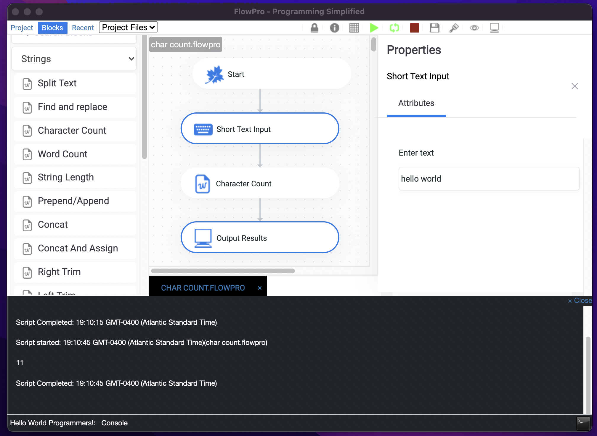

# flowpro-editor

FlowPro Editor is a no code graphical programming tool that allows you to create 
reusable and shareable scripts across various platforms. 
Build simple or complex scripts by dragging and dropping.

## About

FlowPro Editor is a no-code graphic programming script editor that allows you to create reusable and shareable scripts across various platforms. 
Build simple or complex scripts with its easy to use drag and drop interface

## Installation

### For Windows
Download from Windows store [here](https://www.microsoft.com/store/apps/9P350WJPQH84) or
head to the release page and download and extract the installation file.
The application will open once installation is complete.

### For Linux
View the release page for different versions.

Once installed head to the releases page and download the app image.

### For Mac
Head to the release page [here](https://github.com/wyntonfranklin/flowpro/releases/tag/1.0.0-mac).
Select the pkg version. Others will be made available.

## Getting Started

To get started hit the File Menu and choose New FlowPro option give your script a name and get started adding blocks. Its that simple.
Start playing around with the blocks.

